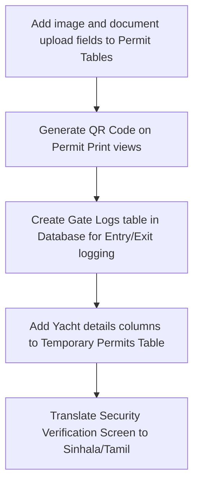

# 📊 Galle Port Entry Permit Management System
## Focused Improvement & Gap Analysis Report (බලපත්‍ර කළමනාකරණයට පමණක් අදාළ වැඩිදියුණු කිරීම් වාර්තාව)

**Date:** June 28, 2026  
**Scope:** Strictly Permit Management Lifecycle (බලපත්‍ර කළමනාකරණ ක්‍රියාවලියට පමණක් සීමා වූ විශ්ලේෂණයකි)  
**Target:** Galle Port (ගාල්ල වරාය)  

---

## 1. Executive Summary / විධායක සාරාංශය
This report is focused strictly on the **Permit Management Lifecycle** of the Galle Port. It analyzes gaps and proposes improvements starting from permit application, billing, printing, gate verification, and entry/exit monitoring. 

මෙම වාර්තාව මඟින් ගාල්ල වරායේ **බලපත්‍ර කළමනාකරණ ක්‍රියාවලිය (Permit Management Lifecycle)** පමණක් විශ්ලේෂණය කර, අයදුම්පත් ලබාගැනීමේ සිට මුරපොලෙන් වරායට ඇතුල්වීම සහ පිටවීම දක්වා වන පියවරයන්හි පවතින අඩුපාඩු සහ ඒවා වැඩිදියුණු කළ හැකි ආකාරය දක්වා ඇත.

---

## 2. The Permit Management Lifecycle & Gaps (බලපත්‍ර කළමනාකරණ ක්‍රියාවලිය සහ අඩුපාඩු)

A complete Permit Management System must cover four main phases. Here are the gaps in the current system under each phase:

---

### Phase A: Permit Application & Verification (අයදුම්පත් ලැබීම සහ සත්‍යාපනය)

#### 1. No Applicant Photograph (ඡායාරූප නොමැතිකම)
*   **Permit Gap:** The system does not capture or store the applicant's profile photo.
*   **Relevance to Permit Management:** Without a photo stored in the database, the issued permit card has no photo. Anyone can enter the port using a lost or borrowed permit card, making identity verification at the gate impossible.
*   **විස්තරය:** බලපත්‍රලාභියාගේ ඡායාරූපයක් පද්ධතියට ඇතුලත් නොවේ. මේ නිසා මුද්‍රණය කරන කාඩ්පතෙහි ඡායාරූපයක් නොමැති අතර, ආරක්ෂක නිලධාරීන්ට බලපත්‍රයේ අයිතිකරු නිවැරදිව හඳුනාගත නොහැක.

#### 2. No Scanned Document Uploads (ලේඛන උඩුගත කිරීමට නොහැකිවීම)
*   **Permit Gap:** The database only stores "Yes/No" checkboxes for documents like NIC, Passport, or Police Reports, but not the actual scanned files.
*   **Relevance to Permit Management:** Clerks cannot visually verify the validity of the NIC or Police Clearance Certificate online. They must rely on physically inspecting paper copies.
*   **විස්තරය:** NIC, Passport හෝ පොලිස් වාර්තා ලැබී ඇති බවට සටහන් කිරීමට (Checkboxes) පමණක් හැකි වුවද, එම ලේඛනවල PDF හෝ Image එකක් සිස්ටම් එකට Upload කිරීමට නොහැක.

#### 3. Missing Yacht Crew & Tourist Fields (යාත්‍රා සේවකයන් සහ සංචාරක තොරතුරු)
*   **Permit Gap:** Galle Port operates an International Yacht Marina. However, the temporary permit screen only asks for standard local designation/company details.
*   **Relevance to Permit Management:** Foreign yacht crews and tourists applying for short-term entry passes require passport details, visa details, yacht agent sponsorships, and yacht names to be printed on the permit.
*   **විස්තරය:** ගාල්ල වරාය ජාත්‍යන්තර යාත්‍රා තොටුපළක් (Yacht Marina) බැවින් එහි පැමිණෙන විදේශීය යාත්‍රා සේවකයන්ට සහ සංචාරකයන්ට බලපත්‍ර නිකුත් කිරීම සඳහා Passport, Visa, යාත්‍රාවේ නම සහ ඒජන්සි විස්තර ඇතුලත් කිරීමේ පහසුකම් බලපත්‍ර පද්ධතියට අවශ්‍ය වේ.

---

### Phase B: Permit Issuing & Printing (බලපත්‍ර නිකුත් කිරීම සහ මුද්‍රණය)

#### 4. Lack of QR Codes on Permits (බලපත්‍ර සඳහා QR කේත නොමැතිකම)
*   **Permit Gap:** Permits are printed in plain text with only a Permit ID string.
*   **Relevance to Permit Management:** Security personnel at the gate cannot verify a permit quickly. They must manually type the ID (e.g., `TP26060001`) into the keyboard, causing delays. A printed QR code on the permit enables instant scan-to-verify.
*   **විස්තරය:** දැනට බලපත්‍ර මුද්‍රණය වන්නේ අකුරු සහ ඉලක්කම් පමණක් සහිතවය. ආරක්ෂක අංශයට සෑම බලපත්‍ර අංකයක්ම පරිගණකයට අතින් ටයිප් කිරීමට සිදුවේ. බලපත්‍රයට QR කේතයක් (QR Code) ඇතුලත් කිරීමෙන් ආරක්ෂක නිලධාරියාට ක්ෂණිකව එය ස්කෑන් කර තොරතුරු බලාගත හැක.

#### 5. Durable Monthly/Annual Passes (RFID/NFC Integration)
*   **Permit Gap:** Long-term passes are issued on paper.
*   **Relevance to Permit Management:** The humid, wet, and salty air at Galle Port easily damages paper permits. The system should support mapping a permanent RFID/NFC plastic card to monthly permit accounts.
*   **විස්තරය:** ගාල්ල වරායේ ලුණු සහිත මුහුදු සුළඟ නිසා කඩදාසි බලපත්‍ර ඉක්මනින් දිරාපත් වේ. ඒ වෙනුවට දිගුකාලීන බලපත්‍රලාභීන්ට RFID කාඩ්පතක් නිකුත් කර එය සිස්ටම් එකේ Permit ID එකට Map කිරීමට හැකි විය යුතුය.

---

### Phase C: Gate Security & Verification (මුරපොල ආරක්ෂාව සහ සත්‍යාපනය)

#### 6. No Entry & Exit Log System (ඇතුල්වීම් සහ පිටවීම් සටහන් නොවීම)
*   **Permit Gap:** The security dashboard only displays whether a permit is valid or invalid. It has no mechanism to log the entry and exit of the permit holder.
*   **Relevance to Permit Management:** For security compliance, a permit system should maintain a live log of who is currently inside the port premises.
*   **විස්තරය:** ආරක්ෂක අංශයට බලපත්‍රය වලංගුදැයි බැලීමට පමණක් හැකි අතර, පුද්ගලයා හෝ වාහනය වරායට ඇතුල් වූ වේලාව සහ පිට වූ වේලාව සටහන් කර ගැනීමට (Entry/Exit logging) ක්‍රමයක් නොමැත.

#### 7. Sri Lanka Navy Base Coordination (නාවික හමුදා ආරක්ෂක අනුමැතීන්)
*   **Permit Gap:** The Sri Lanka Navy base (**SLNS Dakshina**) is inside Galle Port, requiring visitors to pass navy clearance.
*   **Relevance to Permit Management:** The system needs a specific "Navy Cleared" flag or "Naval Destination" status on the permit application to ensure coordination between SLPA security and Naval security.
*   **විස්තරය:** ගාල්ල වරාය පරිශ්‍රයේ "ශ්‍රී ලංකා නාවික හමුදා දක්ෂිණ නාවික කඳවුර" පිහිටා ඇති බැවින්, නාවික හමුදාව වෙත යන පුද්ගලයන් සහ වාහන සඳහා විශේෂ ආරක්ෂක අනුමැතීන් (Navy Clearance Flag) බලපත්‍රය මත සටහන් කිරීමට හැකි විය යුතුය.

#### 8. Multilingual Interface for Gate Personnel (භාෂා සහාය)
*   **Permit Gap:** The security verification dashboard is English-only.
*   **Relevance to Permit Management:** Security guards at the gate need to make split-second decisions. A Sinhala and Tamil translation of the verification result (e.g. **VALID / INVALID / BLACKLISTED**) prevents misinterpretations.
*   **විස්තරය:** මුරපොලේ සේවය කරන නිලධාරීන්ට පහසුවෙන් භාවිත කිරීම සඳහා ආරක්ෂක Dashboard එක සිංහල සහ දෙමළ භාෂාවලින්ද පැවතිය යුතුය.

---

## 3. Technical Roadmap for Developers / තාක්ෂණික සැලැස්ම

To upgrade the permit management application, developers must follow these focused database and controller changes:

### 🛠️ Developer Checklist:
1.  **Database Migration for Uploads:**
    Add columns `photo_path`, `scanned_nic`, `scanned_police_report` to `temporary_permits` and `monthly_permits`.
2.  **Yacht Fields Migration:**
    Add `yacht_name`, `yacht_agent`, `passport_country`, `visa_expiry` to `temporary_permits`.
3.  **QR Code Implementation:**
    Use `simplesoftwareio/simple-qrcode` package. Render the QR code in `permit/print.blade.php`.
4.  **Gate Activity Table:**
    Create a `gate_logs` table recording `permit_id`, `entered_at`, and `exited_at`.

---

## 4. Conclusion
By addressing these eight permit-centric points, the Galle Port Permit system will ensure robust identity validation, eliminate manual gate entry delays, and keep an accurate record of all active visitors within the harbor.
